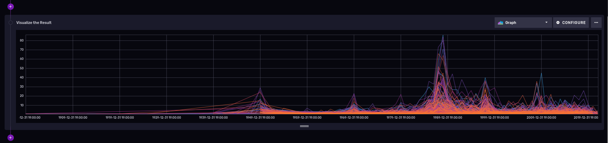

# Analyzing time series data with Python and Influxdb, using public domain datasets

These days you get time series data from multiple sources; you may also argue than using a traditional relational database may not work well with this data because of the following:

* Every datasource requires a custom schema; This means you need to spend more time deciding how to store your data, and if there are changes on the underlying data source then you may have to alter your table schemas
* A traditional relational database doesn't expire the data; For most time series data you may only want to keep a certain window and then discard the rest automatically
* New contenders in this are had optimized their storage format to make it fast for multiple clients to write data, and also to read the latest data; you may recall how relational databases worry much more about data duplicates, row lock contention.

In this tutorial I will show you how to use Influxdb; In particular I like it because it offers integration with other tools out of the box (like [Grafana](https://grafana.com/docs/grafana/latest/getting-started/get-started-grafana-influxdb/), [Python3](https://github.com/influxdata/influxdb-client-python)) and it has a powerful yet simple language to run queries called flux.

## What you will require for this tutorial
 
* A docker or [podman](https://podman.io/) installation, so you can run the Influxdb; you can also do a bare metal installation, but I won't cover that here and instead will use Podman.
* Influxdb 2.4.0 or better, we will use the [Flux](https://www.influxdata.com/products/flux/) language on our queries, instead of [FluxQL](https://docs.influxdata.com/influxdb/cloud/reference/syntax/flux/flux-vs-influxql/).
* A linux distribution (I used Fedora Linux)
* Python3 and [some experience writing scripts](https://www.redhat.com/sysadmin/python-scripting-intro).
* Basic knowledge of relational databases like [MariaDB](https://www.redhat.com/sysadmin/mysql-mariadb-introduction) can be useful, but it is definitely not required to use Flux.

# Running an Influxdb server from a container

This is maybe the easiest way to get you started; We will use an external volume to persist the data across container reboots and upgrades (please check the container page to see [all the possible options](https://hub.docker.com/_/influxdb)):

```shell=
podman pull influxdb:latest
podman run --detach --volume /data/influxdb:/var/lib/influxdb --volumne /data:/data:rw  --name influxdb_raspberrypi --restart always --publish 8086:8086 influxdb:latest
podman logs --follow influxdb_raspberrypi
```

Also, we are mapping an additional volume called /data directory inside the container, to import some CSV files later.

Next go to the machine where you are running influxdb (say http://localhost:8086) and [complete the installation steps](https://docs.influxdata.com/influxdb/v2.4/install/) by:
1. Creating a new user.
2. Creating a [bucket](https://docs.influxdata.com/influxdb/v2.4/organizations/buckets/) (equivalent of a relational database table), with no expiration where we will put our data. We will call it USTS (Underground Storage Tanks) for reasons you will see below.


3. Creating a read/write API token for that works only on the UST buckets.


The API token will look similar to this: ```nFIaywYgg0G6oYtZCDZdp0StZqYmz4eYg23KGKcr5tau05tb7T2DY-LQSIgRK66QG9mkkKuK2nNCoIKJ0zoyng==``` 

Keep it safe, as it will be used to read/ write data into your USTS bucket.

# Working with data sets

On this tutorial I will use publicly available data from the [Connection Data Portal](https://data.ct.gov/).

Specifically we will use the [Underground Storage Tanks (USTs) - Facility and Tank Details](https://data.ct.gov/api/views/utni-rddb/rows.csv?accessType=DOWNLOAD): The underground storage tank regulations and the Connecticut underground storage tank enforcement program have been in effect since November 1985. This list is based on notification information submitted by the public since 1985, and is updated weekly.

I like this dataset for the following reasons:

* Relatively big dataset, 49.1K rows and 27 columns. This will require some data normalization, and large data import techniques.
* It has data in the form of time series (Last Used Date column)
* Also has geographical details (latitude and longitude coordinates), which we can use to run some interesting queries using the geolocation experimental features. 

You can grab a copy with curl, for example:

```shell
[josevnz@dmaf5 influxdb_intro]$ curl --location --silent --fail --show-error --output ~/Downloads/ust.csv 'https://data.ct.gov/api/views/utni-rddb/rows.csv?accessType=DOWNLOAD'
[josevnz@dmaf5 influxdb_intro]$ wc -l ~/Downloads/ust.csv
49090 /home/josevnz/Downloads/ust.csv
```

I'll show you next how you can import your data into your bucket and some issues you may face

# Importing the data

It is a good practice to ask yourself what kind of questions you can answer with the data before even deciding that to import and what to ignore; A few examples we will try to answer soon:

* Total number of tanks reported (active, inactive)
* Number of inactive tanks by installation time
* Number of tanks over type, grouped by substance type
* Number of tanks closer to Hartford, CT

Based on that, we check the available columns and make a quick rain check on what to ignore during the import process:

| Number | Column Name                        | Type        | Remarks                            |
|--------|------------------------------------|-------------|------------------------------------|
| 1      | UST Site ID Number                 | Plain Text  | Ignoring                           |
| 2      | Site Name                          | Plain Text  | Ignoring                           |
| 3      | Site Address                       | Plain Text  | Ignoring, do not care about street |
| 4      | Site City                          | Plain Text  ||
| 5      | Site Zip                           | Plain Text  | Ignoring                           |
| 6      | Tank No.                           | Plain Text  | Ignoring                           |
| 7      | Status of Tank                     | Plain Text  ||
| 8      | Compartment                        | Plain Text  ||
| 9      | Estimated Total Capacity (gallons) | Number      ||
| 10     | Substance Currently Stored         | Plain Text  ||
| 11     | Last Used Date                     | Date & Time ||
| 12     | Closure Type                       | Plain Text  ||
| 13     | Construction Type - Tank           | Plain Text  ||
| 14     | Tank Details                       | Plain Text  | Ignoring                           |
| 15     | Construction Type - Piping         | Plain Text  ||
| 16     | Piping Details                     | Plain Text  | Ignoring                           |
| 17     | Installation Date                  | Date & Time | Ignoring                           |
| 18     | Spill Protection                   | Plain Text  ||
| 19     | Overfill Protection                | Plain Text  ||
| 20     | Tank Latitude                      | Number      ||
| 21     | Tank Longitude                     | Number      ||
| 22     | Tank Collection Method             | Plain Text  | Ignoring                           |
| 23     | Tank Reference Point Type          | Plain Text  | Ignoring                           |
| 24     | UST Site Latitude                  | Number      | Ignoring, redundant                |
| 25     | UST Site Longitude                 | Number      | Ignoring, redundant                |
| 26     | Site Collection Method             | Plain Text  | Ignoring                           |
| 27     | Site Reference Point Type          | Plain Text  | Ignoring, redundant                |

Let's take a peek on our data:

```text
ST Site ID Number,Site Name,Site Address,Site City,Site Zip,Tank No.,Status of Tank,Compartment,Estimated Total Capacity (gallons),Substance Currently Stored,Last Used Date,Closure Type,Construction Type - Tank,Tank Details,Construction Type - Piping,Piping Details,Installation Date,Spill Protection,Overfill Protection,Tank Latitude,Tank Longitude,Tank Collection Method,Tank Reference Point Type,UST Site Latitude,UST Site Longitude,Site Collection Method,Site Reference Point Type
50-11456,Brewer Dauntless Marina,9 NOVELTY LN,ESSEX,06426,1,Permanently Closed,,4000,Gasoline,10/18/2018,Tank was Removed From Ground,Coated & Cathodically Protected Steel (sti-P3),Double Walled,Flexible Plastic,"Containment Sumps @ Dispensers,Containment Sumps @ Tanks,Double Walled,Metallic fittings isolated from soil and water",06/01/1999,Spill Bucket,Ball Float Device,41.350018,-72.385442,Address Matching,Approximate Location,41.350018,-72.385442,Address Matching,Approximate Location
106-1923,FOOD BAG #509,1652 BOSTON POST RD,OLD SAYBROOK,06475,D1,Permanently Closed,a,10000,Diesel,03/01/1998,Tank was Removed From Ground,Coated & Cathodically Protected Steel (sti-P3),,Rigid Fiberglass Reinforced Plastic,,02/01/1983,,,41.286115,-72.414762,Address Matching,Approximate Location,41.286115,-72.414762,Address Matching,Approximate Location
```

As our first take, we can use the Influxdb bulk importers using the line protocol; It basically means we help Influxdb to digest the data as follows:

1. Inform what kind measure we are taking
2. Choose the appropriate types for data types, like numbers, dates, geographical coordinates
3. Choose what columns to skip

Using the [CSV annotation](https://docs.influxdata.com/influxdb/v2.4/write-data/developer-tools/csv/#csv-annotations) is a way to go, but keep in mind it has limitations on how much you can manipulate the during the import process.

Then comes the decision on were and how to store the data; Influxdb has the concept of _tags, fields and measurements_ on, explained on [understanding-Influxdb-basics](https://www.influxdata.com/resources/understanding-Influxdb-basics/):

* A _bucket_ is nothing else but the database where the data will be stored; We will call ours 'covid19'
* Influxdb stores data into _measurements_ (Equivalent of a table on relational databases); Ours will be 'schools'.
* _Tags_: they are a combination of keys and values, they are used on indexes and their values do not change over time; think about them as metadata. In our case, the 'School name', 'City' are tags.
* _Fields_: They change over time, they are not indexed. The school total is a counter that will change over time.
* And finally the _time_: It is the fabric of our data, we will be derived from the 'Report period' and not from the date 'updated fields'

If you notice, we have not one but 2 date time columns:

| Number | Column Name       | Type        | Remarks |
|--------|-------------------|-------------|---------|
| 11     | Last Used Date    | Date & Time ||     |
| 17     | Installation Date | Date & Time ||     |

And, like any time series, [there can only be one dateTime column](https://docs.influxdata.com/influxdb/v2.4/reference/syntax/annotated-csv/extended/#datetime).

So what to do? well, we can either split the data into 2 different buckets, depending on what we want to track, store one of them as a tag (useless as it makes it harder to use), or just ignore it completely.

For our analysis we care more about the last used date, so we will ignore the installation date;


How does that look for our data?

```text
#constant measurement,fuel_tanks
#datatype ignore,ignore,ignore,tag,ignore,ignore,tag,tag,long,tag,dateTime:01/02/2006,tag,tag,ignore,tag,ignore,ignore,tag,tag,double,double,ignored,ignored,ignored,ignored,ignored,ignored
ID,Name,Address,City,Zip,TankNo,Status,Compartment,EstimatedTotalCapacity,SubstanceStored,LastUsed,ClosureType,ConstructionType,Details,ConstructionType,PipingDetails,InstallationDate,SpillProtection,OverfillProtection,Latitude,Longitude,CollectionMethod,ReferencePointType,USTLatitude,USTLongitude,CollectionMethod,ReferencePointType
```

The full command would look something like this ([import_ust.sh](../scripts/import_ust.sh)):
```shell
/usr/bin/podman run --interactive --tty --volume "$header_file:/data/headers.csv" --volume "$csv_file:/data/tanks.csv" influxdb influx write "$dryrun" --bucket $BUCKET --org $ORG --format csv --skipHeader=1 --url "$url" --file "/data/headers.csv" --file "/data/tanks.csv"
```

If you run it in dry mode, you will be able to see the line protocol used to import the data:

```shell
fuel_tanks,City=BRISTOL,ConstructionType=Flexible\ Plastic,OverfillProtection=Audible\ Alarm,SpillProtection=Spill\ Bucket,Status=Currently\ In\ Use,SubstanceStored=Gasoline EstimatedTotalCapacity=15000i,Latitude=41.65641,Longitude=-72.91408
fuel_tanks,City=Hartford,ConstructionType=Flexible\ Plastic,OverfillProtection=Audible\ Alarm,SpillProtection=Spill\ Bucket,Status=Currently\ In\ Use,SubstanceStored=Diesel EstimatedTotalCapacity=1000i,Latitude=41.75538,Longitude=-72.680618
fuel_tanks,City=BERLIN,ConstructionType=Flexible\ Plastic,OverfillProtection=Audible\ Alarm,SpillProtection=Spill\ Bucket,Status=Currently\ In\ Use,SubstanceStored=Gasoline EstimatedTotalCapacity=10000i,Latitude=41.646417,Longitude=-72.729937
...
```

But even with this flexibility there are time when we have to write our custom importer.

## When the CSV annotation falls short

The Influx write is pretty flexible but our data has a present a few challenges that cannot be solved by the tool:

1. The data on this set is not sorted by installation date; this will affect the performance of our queries, so we need to sort the data before inserting it; The influx write command assumes (rightfully) than the data is coming in ordered fashion.
2. City is in some case all caps, not consistent across the board.
3. Last used date is missing in some data points; For our exercise we will assume last used date == current date if the tank is still in use
4. And some tanks that were decommissioned only have the ZIP code, but no coordinates; No problem, will use [uszipcode](https://uszipcode.readthedocs.io/01-Usage-Example/index.html) to get the latitude and longitude.

I ended writing a custom importer script ([import_ust.py](../scripts/import_ust.py)) to handle those cases with grace:

[](https://asciinema.org/a/531659)

# Running some queries

Finally, time to run a few queries

## Total number of tanks reported (active, inactive)

```text
from(bucket: "USTS") 
  |> range(start: -100y)
  |> filter(fn: (r) => r["_measurement"] == "fuel_tanks")
  |> filter(fn: (r) => r._field == "estimated_total_capacity")
  |> group(columns: ["status"])
  |> count(column: "_value")
  |> group(columns: ["_value", "status"], mode: "except")
  |> sort(columns: ["_value"], desc: true)
```

And we can see we have 3 categories, 25,831 permanently closed tanks in CT.


## Number of closed fuel tanks all time, per city

So quite a bit of 'permanently closed', do they distribute differently over time?

```text
from(bucket: "USTS")
    |> range(start: -100y)
    |> filter(fn: (r) => r._measurement == "fuel_tanks" and r._field == "estimated_total_capacity" and r.status == "permanently closed")
    |> truncateTimeColumn(unit: 1y)
    |> group(columns: ["city", "_time"])
    |> count(column: "_value")
    |> drop(columns: ["closure_time", "construction_type", "overfill_protection", "substance_stored", "s2_cell_id_token", "lat", "lon"])
    |> group(columns: ["city"])
```

This will generate a group of tables (towns) over time (e use the truncateTimeColumn to drop date and time granularity in our series data):



Winner is Bridgeport!

## Number of tanks, grouped by substance type

Gasoline? Oil? Let's see what is currently in use, last 15 years:

```text
from(bucket: "USTS")
    |> range(start: -5y)
    |> filter(fn: (r) => r._measurement == "fuel_tanks" and r._field == "estimated_total_capacity" and r.status == "currently in use")
    |> group(columns: ["substance_stored"])
    |> count(column: "_value")
    |> drop(columns: ["city", "closure_tipe", "construction_type", "overfill_protection", "s2_cell_id", "lat", "lon", "_time", "spill_protection", "status"])
    |> group()
    |> sort(columns: ["_value"], desc: true)
```

And the results:


## Number of tanks closer to Hartford, CT

At the time of this writing (influx 2.4.0) this something that is _labeled as experimental on Influxdb_; native support of geolocation capabilities inside the database [is a very useful feature](https://docs.influxdata.com/influxdb/cloud/query-data/flux/geo/), let's explore it next.

If you want to take a quick taste of the geolocation capabilities, you could run the following on a notebook:

```text
import "influxdata/influxdb/sample"
import "experimental/geo"
sampleGeoData = sample.data(set: "birdMigration")
sampleGeoData
    |> geo.filterRows(region: {lat: 30.04, lon: 31.23, radius: 200.0}, strict: true)
```

First, a bit of geography:

> Hartford, CT, USA Latitude and longitude [coordinates are: 41.763710, -72.685097](https://www.latlong.net/place/hartford-ct-usa-2637.html).

Count tanks within 30 miles (48.28032 Kilometers) radio from our Hartford coordinates, last 5 years:

```text
import "experimental/geo"
from(bucket: "USTS")
    |> range(start: -5y)
    |> filter(fn: (r) => r._measurement == "fuel_tanks" or r._field == "lat" or r.field == "lon" and r.status == "currently in use")
    |> geo.filterRows(region: {lat: 41.763710, lon: -72.685097, radius: 48.28032}, strict: false)
    |> drop(columns: ["closure_time", "construction_type", "overfill_protection", "substance_stored", "s2_cell_id_token", "lat", "lon", "spill_protection", "s2_cell_id", "_time", "status", "closure_type"])
    |> count(column: "estimated_total_capacity")
    |> group(columns: ["city"])
    |> group()
    |> sort(columns: ["estimated_total_capacity"], desc: true)
```

And here are the partial results:


# You can also query the data from your favorite programming language

Let's take the query we used to get how many tanks per substance type ara available for a given period time.

```python
from influxdb_client import InfluxDBClient

# You can generate a Token from the "Tokens Tab" in the UI
token = "pP25Y9broJWTPfj_nPpSnGtFsoUtutOKsxP-AynRXJAz6fZzdhLCD4NqJC0eg_ImKDczbMQxMSTuhmsJHN7ikA=="
org = "Kodegeek"
bucket = "USTS"

with InfluxDBClient(url="http://raspberrypi:8086", token=token, org=org) as client:
    query = """from(bucket: "USTS")
    |> range(start: -15y)
    |> filter(fn: (r) => r._measurement == "fuel_tanks" and r._field == "estimated_total_capacity" and r.status == "currently in use")
    |> group(columns: ["substance_stored"])
    |> count(column: "_value")
    |> drop(
        columns: [
            "city",
            "closure_type",
            "construction_type",
            "overfill_protection",
            "s2_cell_id",
            "lat",
            "lon",
            "_time",
            "spill_protection",
            "status",
        ],
    )
    |> group()
    |> sort(columns: ["_value"], desc: true)"""
    tables = client.query_api().query(query, org=org)
    for table in tables:
        for record in table.records:
            print(record)
```

We can do then tweak the Python code and make it better:

[](https://asciinema.org/a/531776)

Not so bad. Same can be done in other languages like Java, etc.

# What is next?

* The [Connecticut OpenData portal](https://data.ct.gov/) has lots more interesting data sets you can download for free and learn about the state; I bet you have similar portals with public data where you live.
* The [Flux language](https://docs.influxdata.com/flux/v0.x/) is an interesting choice compared to plain SQL to analyze time series; I found it intuitive to use, but still learning a few kinks.
* How fast is Influxdb compared other offerings? You need to decide for yourself. I haven't spent [much time tuning settings](https://www.influxdata.com/blog/optimizing-influxdb-performance-for-high-velocity-data/), instead my initial interest was how easy is to use and integration with other applications, like [Grafana](https://grafana.com).
* If you write scripts in Python, you should definitely take a look at the [examples from the Git repository](https://github.com/influxdata/influxdb-client-python).
* And of course, [check the source code](https://github.com/josevnz/influxdb_intro) in the repository for this tutorial.

